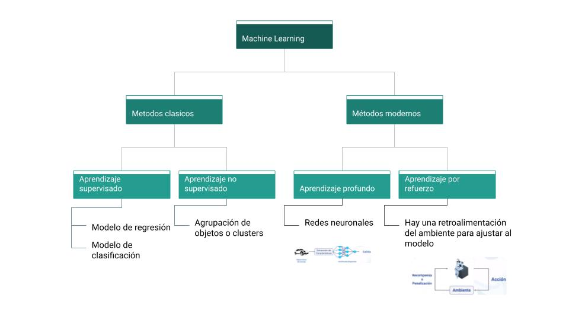
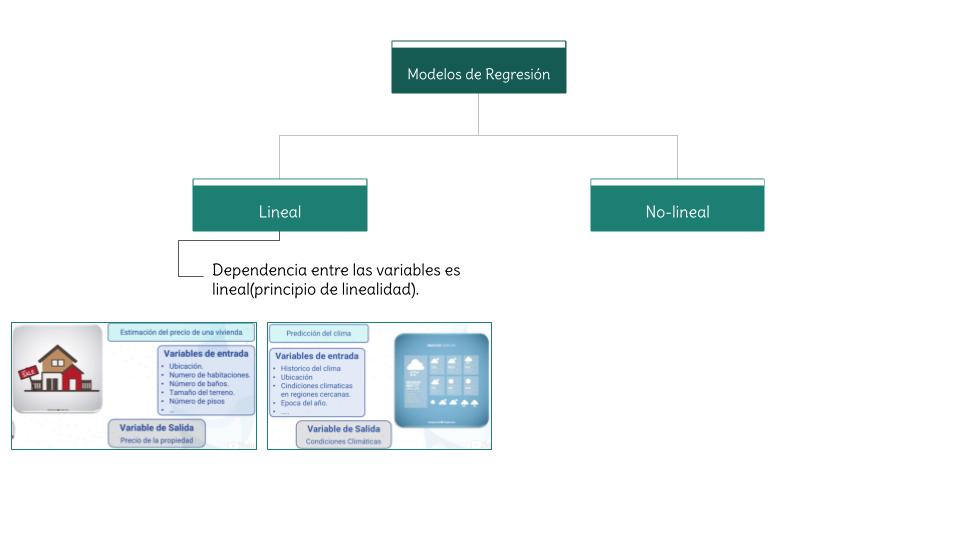

# Aprendiendo Machine Learning
## Recursos
- [Introducción a Machine Learning](https://learning.edx.org/course/course-v1:URosarioX+URX59+2T2023/home)

## IA vs Machine Learning
| IA           | Machine learning |
| ------------ | ------------ |
| Desarrollar sistemas      | Permite que las máquinas aprendan sin ser expresamente programadas para ello.      |
| Modelo basado en datos.    | Metodos clasicos:  aprendizaje supervisado, aprendizaje no supervisado     |
| Inteligencia artificial fuerte e inteligencia artificial debil  | Metodos modernos: aprendizaje profundo, aprendizaje por refuerzo

## Machine learning (aprendizaje automatico)

### Metodos clasicos
- **Aprendizaje supervisado:** Relaciona un conjunto de variables de entrada con unas de salidad, las variables de entrada y salida son conocidas. Hay marcadores.
- **Aprendizaje no supervisado:** Hay datos de entrada pero no hay una variable de salida. No hay marcadores.
### Metodos modernos
- **Aprendizaje profundo:** para mitigar la complejidad, se realiza la extracion y seleccion de caracteristicas.
- **Aprendizaje por refuerzo:** entrenar un sistema para que realize una tarea dada.

## Regresion Lineal

- Los modelos de regresión permiten explicar la relación que existe entre un conjunto de datos de entrada(**variables independientes**) con un conjunto de datos de salida(**variables dependientes**).
  - variables independientes: se pueden modificar
  - variables dependientes: dependen de las variables dependientes y el modelo.
- **Objetivo:** encontrar una funcion que relacione los datos de entrada *x*  con una salida *y*.
    $y=f(x)+\varepsilon $
    Donde:
    - y -> Variable dependiente
    - x -> Variable independiente
    - $\varepsilon$ -> error de prediccion(**Nota: tiene que ser lo mas pequeño posible**)
    - $f(x)$ -> modelo matematico
- Modelo simple: a y b son los parametros del modelo.
  - Objetivo: encontrar valores de *a* y *b* que minimizen el error entre los valores observados y la estimacion del modelo. El modelo debe ser lineal en funcion a los parametros.
    - $y=ax + b +\varepsilon $
- Modelo mas complejo:
  -  $y=\theta _{0} + \theta _{1}x + \theta _{2}x^{2} + ... + \theta _{n}x^{n}+\varepsilon $
  -  Modelo no lineal entre *x* y *y*, pero lineal entre los $\theta_{i}$